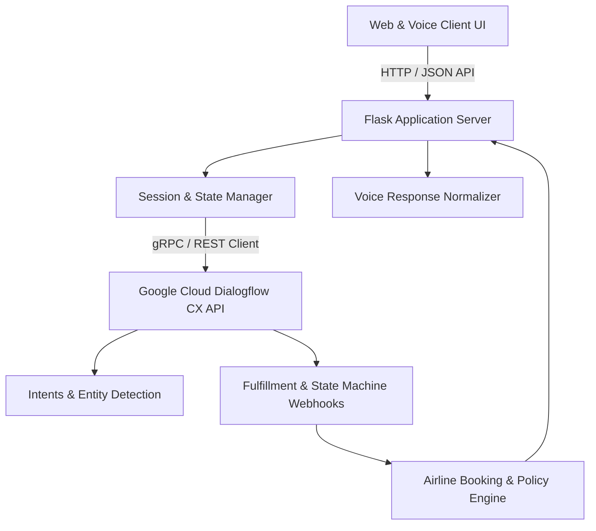

<div align="center">

# ✈️ AeroFlow Airline Agent

**AI-Powered Conversational Airline Customer Service & Flight Booking Assistant**

[](https://www.python.org/)
[](https://flask.palletsprojects.com/)
[](https://cloud.google.com/dialogflow/cx/docs)
[](https://gunicorn.org/)
[](LICENSE)

<p align="center">
  An intelligent, omnichannel conversational assistant and flight booking portal integrating Google Cloud Dialogflow CX, voice synthesis, real-time ticket inquiry, policy guidance, and trip management.
</p>

</div>

---

## 🌟 Key Features

- 🤖 **Dialogflow CX Conversational Core**: Advanced Natural Language Understanding (NLU) state machine handling multi-turn flight inquiries, luggage policies, and status lookups.
- 🎙️ **Omnichannel Voice & Speech Synthesis**: Natural voice response formatting tailored for speech engines, resolving airport codes and abbreviations into fluent speech.
- 🛫 **Flight Search & Booking Flow**: Interactive passenger booking flow with departure/arrival date validation, cabin class selection, and seat assignments.
- 💼 **Trip & Baggage Management**: Automated resolution of baggage dimensions, weight limits, lost luggage claims, and itinerary lookups.
- ⚡ **Production-Ready Flask Backend**: Clean modular architecture powered by Flask 3.0 and Gunicorn with asynchronous Dialogflow CX session management.
- 📱 **Modern Responsive UI**: Clean web portal with integrated live chat widget, interactive trip planner, and destination guides.

---

## 🏗️ System Architecture



| Component | Technology | Role |
| :--- | :--- | :--- |
| **Frontend** | HTML5 / Vanilla CSS / JS | Interactive booking interface & conversational modal |
| **Backend Framework** | Flask 3.0.3 / Werkzeug | REST API endpoints, routing, and upload handling |
| **Conversational AI** | Google Dialogflow CX | Natural language processing, entity extraction, intent routing |
| **Voice Processing** | Regex / Phonetic Normalizer | Acronym expansion (BA, PCR, Wi-Fi) for natural text-to-speech |
| **WSGI Server** | Gunicorn 23.0.0 | High-concurrency production HTTP application server |

---

## 📁 Repository Structure

```text
aero-flow-airline-agent/
├── dialogflow_api.py       # Dialogflow CX client & session fulfillment handler
├── main.py                 # Flask server, route controllers, and voice formatters
├── requirements.txt        # Python dependency specification
├── static/
│   ├── css/                # Custom styling for booking dashboard & chat widget
│   ├── js/                 # Client-side chat, voice recording, and AJAX calls
│   └── uploads/            # Temporary attachment uploads (documents/images)
├── templates/
│   ├── index.html          # Main portal homepage and booking console
│   └── chat.html           # Standalone conversational agent interface
└── Images/                 # Screenshots and interface previews
```

---

## 🚀 Getting Started

### Prerequisites

- **Python**: `>= 3.9`
- **Google Cloud Platform Account**: With Dialogflow CX API enabled and service account credentials JSON.

### 1. Clone & Setup Virtual Environment

```bash
git clone https://github.com/the-forgotten-polymath/aero-flow-airline-agent.git
cd aero-flow-airline-agent

python3 -m venv venv
source venv/bin/activate   # On Windows: venv\Scripts\activate
pip install -r requirements.txt
```

### 2. Environment & Google Cloud Configuration

Export your Google Cloud service account key and Dialogflow configuration:

```bash
export GOOGLE_APPLICATION_CREDENTIALS="/path/to/your-service-account-key.json"
export DIALOGFLOW_PROJECT_ID="your-gcp-project-id"
export DIALOGFLOW_AGENT_ID="your-dialogflow-agent-id"
export DIALOGFLOW_LOCATION="global"
```

### 3. Run Locally

```bash
# Start Flask development server
python main.py
```
Open your browser at `http://localhost:8080` (or `http://localhost:5000`).

### 4. Production Deployment

```bash
gunicorn --bind 0.0.0.0:8080 --workers 4 main:app
```

---

## 💬 Dialogflow CX Intents Supported

- **Flight.Booking**: Handles origin, destination, dates, passenger count, and cabin class.
- **Flight.Status**: Real-time status lookup using flight numbers or city pairs.
- **Policy.Baggage**: Carry-on and checked luggage dimensions, weight restrictions, and prohibited items.
- **Support.CheckIn**: Step-by-step guidance for mobile, kiosk, and web check-in.
- **Loyalty.Inquiry**: Points balance, executive tier status, and reward redemptions.

---

## 📄 License

This project is open source and available under the [MIT License](LICENSE).
